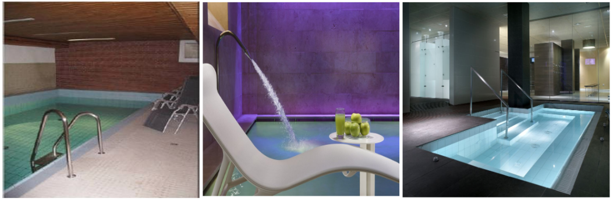
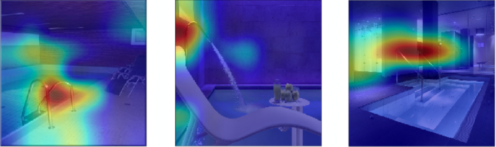
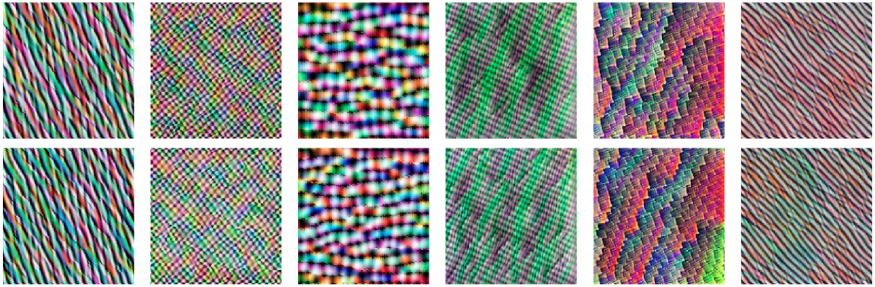

# Interpreting Convolutional Neural Network (CNN) Results

This repo contains the code for our talk "Demystifying the neural network black box". Slides are available on [Speaker Deck](https://speakerdeck.com/tanujjain/demystifying-the-neural-network-black-box).

## Motivation

Convolutional Neural Networks (CNN) are state of the art when it comes to computer vision tasks such as image recognition and object detection. However, due to the high amount of architectural complexity, it is often difficult to interpret the decisions made by these networks. Luckily, there are several techniques available which can enhance our comprehension of CNN decisions. These techniques are generally divided into attribution and visualisation methods.

In one of our image classification projects at [idealo](https://www.idealo.de/), we wished to recognise the area of hotel property depicted in the images. There were several cases where images depicting a Swimming Pool area were misclassified as belonging to the Bathroom area. Some examples of such images are as below:

Using an **attribution technique** called [Gradient Class Activation Maps (Grad-CAM)](https://arxiv.org/pdf/1610.02391.pdf), we were able to draw a heatmap that indicates the relative importance of different image areas in making the classification decision. Heatmaps for the above images are as below:

This helped us discover a bias for using metallic rails as a means to misclassify images as belonging to Bathroom area.

On the other hand, **visualization techniques** helped us understand the patterns that neurons at different layers in the CNN might be learning. Some visualisations for a specific layer of MobileNet architecture fitted to our data are as below:

These patterns usually get increasing complex as one progresses towards the output layer of a CNN.

## Getting Started

In this repository, several interpretation techniques have been demonstrated with Google Colab notebooks. There is no need to clone this repository. Google Colab notebooks for attribution and visualisation methods can be launched in the browser by simply clicking the 'Open in Colab' icon in the respective sections below. Additionally, the 'Hardware accelerator' for Colab notebooks should be set to 'GPU' for a quicker run through the code. For a quick tutorial on Colab notebooks, check out [this blog post](https://medium.com/deep-learning-turkey/google-colab-free-gpu-tutorial-e113627b9f5d).

### Attribution techniques:

Some of the attribution methods we have tried to explore are:
- [Saliency Maps](https://arxiv.org/pdf/1312.6034v2.pdf)
- [Gradient Class Activation Maps (Grad-CAM)](https://arxiv.org/pdf/1610.02391.pdf)
- [Layerwise Relevance Propagation (LRP)](https://journals.plos.org/plosone/article?id=10.1371/journal.pone.0130140)

### Visualization techniques

Some of the visualization methods we have tried to explore are:
- [Filter visualizations](https://distill.pub/2017/feature-visualization/)
- [Output class visualizations](https://distill.pub/2017/feature-visualization/)

### Acknowledgement

Several awesome Python packages have been used for this work:
- [DeepExplain](https://github.com/marcoancona/DeepExplain#egg=deepexplain)
- [Lucid](https://github.com/tensorflow/lucid)
- [keras-vis](https://github.com/raghakot/keras-vis)

## LICENSE

See [LICENSE](LICENSE) for details.
